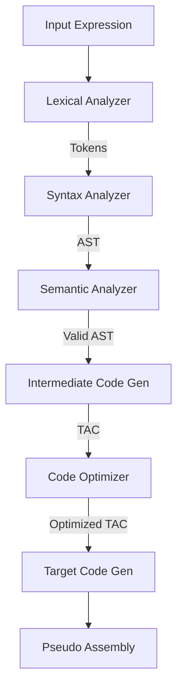

# 🚀 XLang: A Multi-Phase Compiler Implementation

**XLang** is a modular compiler built to demonstrate the core principles of Compiler Design. It translates high-level expressions into optimized pseudo-assembly through a structured 6-phase pipeline.
---
## 👥 Team

| S.No | Name | Roll Number |
|------|------|-------------|
| 1 | K. Adithya | 160123733189 |
| 2 | K.G.S Karthekeya| 160123733190 |
| 3 | M Harshith | 160123733191 |
| 4 | Majji Pradeep | 160123733192 |
| 5 | S. Aryan | 160123733202 |

| Field | Details |
|-------|---------|
| 🎓 Guide | Dr. G. Vanitha |
| 🏫 College | Chaitanya Bharathi Institute of Technology (CBIT), Hyderabad |
| 📅 Year | 2025–2026 |

---

## 🌳 Compiler Architecture Flow



---

## 👥 Phase-by-Phase Detailed Breakdown

Each team member is responsible for a specific phase of the compiler. Below is the detailed technical content for each phase.

---

### 🧩 Phase 1: Lexical Analysis (Harshith)
**Responsibility**: Converting raw source code (strings) into a sequence of meaningful tokens.

- **How it works**: Uses **Regular Expressions (Regex)** to scan the input string character by character.
- **Tokens Handled**:
    - **Assignment**: `<-`
    - **Arithmetic**: `+`, `-`, `*`, `/`
    - **Custom Operators**: `@` (Sum of Squares), `#`, `$`, `^`
    - **Literals**: Integers and Floating point numbers.
    - **Identifiers**: Variable names.
- **Key Implementation**: The `lex.py` module uses a list of regex patterns. When a match is found, it creates a tuple `(Index, Type, Lexeme)`.
- **Presentation Point**: *"My job is to ignore whitespace and comments and group characters into logical units called tokens. Without this, the compiler wouldn't understand what 'x' or '+' means."*

---

### 🌳 Phase 2: Syntax & Semantic Analysis (Karthikeya)
**Responsibility**: Building a structural representation (AST) and validating the logic.

- **Syntax Analysis**: Implements a **Recursive Descent Parser**. It follows the grammar rules to handle operator precedence (e.g., `*` before `+`).
- **Data Structure**: Builds an **Abstract Syntax Tree (AST)**.
    - *Example*: `a + b * c` creates a tree where `+` is the root, `a` is the left child, and `*` is the right child.
- **Semantic Analysis**: Walks the AST to ensure:
    - Variables are declared before use.
    - Operand types are compatible (e.g., you can't add a string to a number).
- **Presentation Point**: *"I ensure the code follows the 'grammar rules' of XLang. If the user writes '5 + + 2', my parser will catch the syntax error. I also check the 'meaning' to ensure variables actually exist."*

---

### ⚙️ Phase 3: Intermediate Code Generation (Adithya)
**Responsibility**: Flattening the hierarchical AST into a linear instruction set.

- **Method**: Converts the AST into **3-Address Code (TAC)**.
- **Logic**: Every complex expression is broken down into simple operations involving at most three addresses (two operands and one result).
- **Temporary Variables**: Uses `t1`, `t2`, `t3`... to store intermediate values.
- **Special Operators**: If a custom operator like `@` (sum of squares) is encountered, ICG expands it into:
    ```text
    t1 = a * a
    t2 = b * b
    t3 = t1 + t2
    ```
- **Presentation Point**: *"ICG acts as a bridge. Machines can't execute trees directly, so I flatten the logic into a list of simple 't = a op b' steps that are much closer to assembly."*

---

### 🚀 Phase 4: Code Optimization (Aaryan)
**Responsibility**: Improving the intermediate code for better performance.

- **Techniques Implemented**:
    1. **Constant Folding**: Pre-calculating results like `2 + 3` into `5` at compile-time.
    2. **Copy Propagation**: If `a = b`, replacing future uses of `a` with `b` to save assignments.
    3. **Dead Code Elimination**: Removing instructions whose results are never used.
- **Result**: The code becomes shorter and faster without changing the final output.
- **Presentation Point**: *"My phase makes the compiler 'smart'. Instead of making the computer calculate '10 / 2' every time the program runs, I do it once during compilation to save CPU time."*

---

### 🖥️ Phase 5: Target Code Generation & Integration (Pradeep)
**Responsibility**: Generating the final "machine" code and orchestrating the system.

- **Target Language**: **Pseudo-Assembly**.
- **Model**: Uses an accumulator-based architecture.
- **Instruction Set**:
    - `LOAD [var]`: Move value to accumulator.
    - `ADD/SUB/MUL/DIV [var]`: Perform math with accumulator.
    - `STORE [var]`: Move result from accumulator to memory.
- **System Integration**: I created `main.py` which pipes the output of the Lexer into the Parser, then into Semantic, ICG, Optimizer, and finally CodeGen.
- **Presentation Point**: *"I translate the abstract logic into physical instructions. I also integrated everyone's work into a single pipeline so that a user can simply type an expression and see the final execution."*

---

## 🛠️ How to Run & Present

1. **Execution**:
   ```bash
   python3 main.py
   ```
2. **Standard Test Case**: `x <- a + 5 * 2`
3. **Complex Test Case**: `y <- 10 + 20 / 4 @ 2`

---

## 🌟 Technical Highlights
- **Modular Design**: Each phase is a separate Python module (`lex.py`, `parser.py`, etc.).
- **Extensible**: New operators can be added by simply updating the Lexer and ICG logic.
- **Educational**: Designed to demonstrate the exact workflow taught in Compiler Design courses.

---

## 📊 Sample Test Case & Output

**Input**: `y <- 10 + 20 / 4 @ 2`

```text
LEXICAL ANALYSIS TABLE

Index     Token Type     Lexeme         
----------------------------------------
0         NUMBER         10             
1         OPERATOR       +              
2         NUMBER         20             
3         OPERATOR       /              
4         NUMBER         4              
5         OPERATOR       @              
6         NUMBER         2              

--- PARSER OUTPUT (AST) ---
 <-__       
/    \      
y    +__    
    /   \   
   10   /_  
       /  \ 
      20  @ 
         / \
         4 2

--- SEMANTIC ANALYSIS ---
Validation Successful: No errors found.

--- ORIGINAL TAC ---
Step      Instruction
---------------------------------------------
1         t1 = 4 * 4
2         t2 = 2 * 2
3         t3 = t1 + t2
4         t4 = 20 / t3
5         t5 = 10 + t4
6         y = t5

--- OPTIMIZED TAC ---
Step      Instruction
---------------------------------------------
1         t3 = 16 + 4
2         t4 = 20 / t3
3         t5 = 10 + t4
4         y = t5

--- TARGET CODE (PSEUDO ASSEMBLY) ---
Step      Instruction
---------------------------------------------
1         LOAD 16
2         ADD 4
3         STORE t3

4         LOAD 20
5         DIV t3
6         STORE t4

7         LOAD 10
8         ADD t4
9         STORE t5

10        LOAD t5
11        STORE y
```
